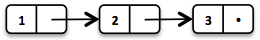

== Javaslang

Javaslang[1] stellt viele neue persistente Datenstrukturen, algebraische Datentypen (Summen- und Produkt-Typen) und bessere funktionale Interfaces für Java8 bereit. Alle Datentypen bauen auf drei Basis-Datentypen auf: Tuple, Lambda und Value. Jeder Datentyp in Javaslang, der einen Wert repräsentiert, ist vom Basis-Datentyp Value abgeleitet. Bei der Namensgebung der Datentypen orientiert sich Javaslang stark an Scala. Das besondere an den Datenstrukturen von Javaslang ist, dass sie persistent und somit unveränderlich sind.

.Javaslang Datenstrukturen
image::images/javaslang-overview.png[]

Eine persistente Datenstruktur kann verändert werden, liefert aber eine veränderte Kopie von sich selbst zurück und behält ihren vorherigen Zustand. Man kann also sagen, dass persistente Datenstrukturen unveränderlich sind, da sie effektiv nach ihrer Erstellung nicht mehr modifiziert werden können. Damit das Verändern von persistenten Datenstrukturen nicht zu speicherintensiv ist, können sie sich im Speicher vorgehaltene Werte teilen. Das lässt sich am besten am Beispiel einer verketteten Liste erläutern. Listing 1 zeigt, wie mit Javaslang eine Liste erstellt und modifiziert werden kann.

[source,java]
.Listing 1
----
// = List(1, 2, 3)
List<Integer> list1 = List.of(1, 2, 3);

// = List(0, 2, 3)
List<Integer> list2 = list1.replace(1,0);
----

Zunächst wird eine Liste mit drei Werten erstellt und anschließend der erste Wert der Liste modifiziert. Siehe Abbildung 1. Der zweite Aufruf erzeugt eine Kopie der Liste, die sich die gemeinsamen Knoten mit der ursprünglichen Liste teilt. Siehe Abbildung 2.

.Abbildung 1

.Abbildung 2
image::images/list2.png[Abbildung 2]
