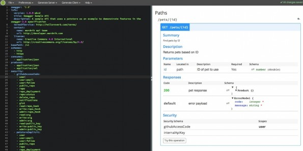

== Swagger

Swagger ist das momentan weitverbreiteste Spezifikationsformat für RESTful APIs. Um Swagger herum hat sich eine große Tool-Landschaft gebildet. Zum Beispiel die Online-Kollaborationsplattform SwaggerHub, die die Zusammenarbeit an einer Swagger Spezifikation ermöglichen soll. SwaggerHub unterstützt den gesamten Lebenszyklus einer API und bietet hierfür einen Online-Editor für die Erstellung einer Swagger Spezifikationen an, sowie eine Integration mit GitHub, Versionisierung und Codegenerierung.
Ursprünglich war Swagger in der Version 1.2 ein Code-First Framework mit Hilfe dessen aus Source Code eine Swagger Spezifikation im JSON Format generiert werden konnte. Seit Version 2 wird auf einen Contract-First Ansatz im YAML-Format gesetzt. Die Version 2 wurde von der Open API Initiative als Basis für die OpenAPI Spezifiktation übernommen.

NOTE: http://www.yaml.org/spec/1.2/spec.html[YAML] ist eine Auszeichnungssprache zur Datenserialisierung und eine Untermenge von JSON. Das Akronym YAML steht für „YAML Ain’t Markup Language“. YAML ist wesentlich leichter von Menschen zu lesen und zu schreiben als beispielsweise JSON oder XML.

SwaggerHub bietet einen Online-Editor an, mit dem eine RESTful API spezifiziert werden kann. In Listing 1 wird ein Ausschnitt der Swagger Petstore API dargestellt. Der REST-API Endpunkt `pets/{petId}` beispielsweise ermöglicht es ein Pet über eine ID zu finden. In der Swagger Spezifikation wird der Input-Parameter des Endpunkts und die möglichen Antwortnachrichten spezifiziert, sowie die Defintion für das `Pet` Model, das in der Antwortnachricht zurückgeliefert wird.

.Swagger Online Editor

.Listing 1
[source, yaml]
----
swagger: "2.0"
info:
  description: This is a sample server Petstore server.
  version: "1.0.0"
  title: Swagger Petstore
host: petstore.swagger.wordnik.com
basePath: /v2
schemes:
  - https
paths:
  /pets/{petId}:
    get:
      tags:
        - pet
      summary: Find pet by ID
      description: Returns a pet
      produces:
        - application/json
      parameters:
        - in: path
          name: petId
          description: ID of pet that needs to be fetched
          required: true
          type: integer
          format: int64
      responses:
        "200":
          description: successful operation
          schema:
            $ref: "#/definitions/Pet"
        "400":
          description: Invalid ID supplied
        "404":
          description: Pet not found
definitions:
  Pet:
    required:
      - name
      - photoUrls
    properties:
      id:
        type: integer
        format: int64
      category:
        $ref: "#/definitions/Category"
      name:
        type: string
        example: doggie
      status:
        type: string
        description: pet status in the store
----

Die erstellte Spezifikation wird in dem Editor live als eine interaktive HTML-basierte API-Dokumentation dargestellt. 

.Swagger HTML Dokumentation
image::images/html_swagger.png[]

Diese interaktive HTML-Dokumentation hat einige Mankos. Zum einen liegt der Fokus der Dokumentation eindeutig auf den REST-API Endpunkten, z.B. `GET /pets/{petId}` und nicht auf einer kurzen Beschreibung der Funtionalität, die von diesem Endpunkt angeboten wird, wie z.B. "Find Pet by ID". Ein Entwickler, dem die API unbekannt ist, würde sicher nicht nach einem konkreten REST-API Endpunkt suchen, sondern nach der benötigten Funtionalität.
Des Weiteren kann die HTML-Dokumentation nicht offline angeschaut oder als PDF exportiert werden. Ein PDF-Format ist aber häufig notwendig, wenn die API-Dokumentation in einer Ausschreibung für ein Software-Projekt mit ausgehändigt werden muss.
Ein weiteres Manko ist, dass die Dokumentation nicht um weitere Details erweitert werden kann, wie z.B. Nutzungsbeispiele in verschiedenen Programmiersprachen oder komplexere HTTP-Request und HTTP-Response Beispiele. 

Es stellen sich also zwei Fragen:

* Wie kann eine Swagger Spezifikation um handgeschriebene Dokumentation erweitert werden?
* Wie kann die Dokumentation sowohl im HTML als auch PDF Format erstellt werden?
