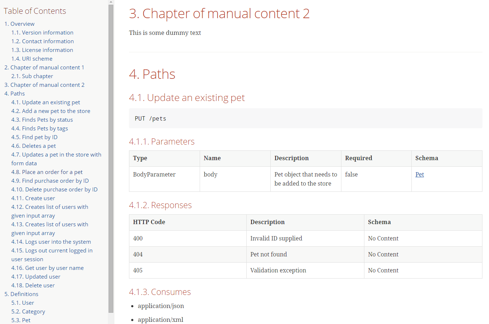

== Swagger2Markup

Mit https://github.com/Swagger2Markup[Swagger2Markup] gibt es ein Open Source Projekt, dass es ermöglicht eine Swagger Spezifikation in AsciiDoc, Markdown or Atlassian Confluence Wiki Markup zu konvertieren. Die Swagger Spezifikation kann sowohl im YAML als auch im JSON Format vorliegen und sowohl lokal als auch remote über HTTP geladen werden. 
Die Verwendung von Swagger2Markup ist simpel. Listing 2 zeigt wie eine Swagger Spezifikation in AsciiDoc konvertiert werden kann. AsciiDoc ist als Standard-Ausgabeformat vorkonfiguriert. Es muss nur die Quelle und der Zielordner angegeben werden. In diesem Beispiel wird die Swagger Petstore API Demo Spezifikation über HTTP geladen.

.Listing 2
[source,java]
----
//Local Swagger source
URL remoteSwaggerFile = new URL("http://petstore.swagger.io/v2/swagger.json");
Path outputDirectory = Paths.get("build/asciidoc");

Swagger2MarkupConverter.from(remoteSwaggerFile) 
        .build() 
        .toFolder(outputDirectory);
----

Standardmäßig werden vier AsciiDoc-Dateien generiert: _overview.adoc_, _security.adoc_, _paths.adoc_ und _definitions.adoc_. Diese generierten Dateien können nun mit handgeschriebener Dokumentation (z.B. `hand_written_1.adoc` und `hand_written_2.adoc`) beliebig kombiniert werden. Es können aber auch einzelne Dateien für jede Operation und Model Definition generiert werden. Die handgeschriebene Dokumentation kann Informationen beinhalten, die mit Swagger nicht abbildbar sind, z.b. ein Tutorial zur Nutzung der API mit Request und Response Beispielen.
Hierzu erstellt man eine `index.adoc` Datei, die alle Dateien inkludiert. Der Platzhalter `{generated}` steht für den Ordner in den die Dateien generiert wurden.

.Listing 3
----
\include::{generated}/overview.adoc[]
\include::manual_content1.adoc[]
\include::manual_content2.adoc[]
\include::{generated}/security.adoc[]
\include::{generated}/paths.adoc[]
\include::{generated}/definitions.adoc[]
----

Mit Hilfe des Open Source Projekts https://github.com/asciidoctor/asciidoctorj[Asciidoctorj] kann die `index.adoc` Datei in HTML, PDF oder andere Formate konvertiert werden. 
Für Swagger2Markup und Asciidoctorj gibt es auch Gradle oder Maven Plugins, um die Konvertierung in einer Build-Pipeline zu automatisieren. Auf GitHub gibt es zwei Template-Projekte, die den Start mit Gradle oder Maven vereinfachen sollen.

Die generierte HTML oder PDF-Dokumentation sieht dann wie folgt aus:

.AsciiDoc HTML Dokumentation

Swagger2Markup hat viele Konfigurationsparameter und kann über verschiedene Wege konfiguriert werden, z.B. System Properties, Properties-Datei, Fluent-API oder einer Java Map. Listing 4 zeigt beispielsweise die Verwendung der Fluent-API.

[source,java]
.Listing 4
----
Swagger2MarkupConfig config = new Swagger2MarkupConfigBuilder()
        .withMarkupLanguage(MarkupLanguage.MARKDOWN) 
        .withOutputLanguage(Language.DE) 
        .withPathsGroupedBy(GroupBy.TAGS) 
        .build(); 

Swagger2MarkupConverter converter = Swagger2MarkupConverter.from(localSwaggerFile)
        .withConfig(config) 
        .build();
----

Swagger2Markup stellt auch ein Service Provider Interface (SPI) und Extension Points bereit, mit der eigene Extensions entwickelt werden können und somit der Funktionsumfang von Swagger2Markup erweitert werden kann.

Mit Hilfe von Gradle (oder auch Maven) lässt sich eine lokale Swagger Spezifikation, die in dem Ordner `src/docs/swagger` liegt automatisiert konvertieren. Hierfür müssen das Swagger2Markup und das Asciidoctorj Gradle Plugin geladen und die Tasks `convertSwagger2markup` und `asciidoctor` konfiguriert werden. Siehe Listing 5. Mit dem Kommando `gradlew asciidoctor` kann nun eine HTML und PDF Dokumentation generiert werden.

[source,groovy]
.Listing 5
----
buildscript {
    dependencies {
        classpath 'org.asciidoctor:asciidoctor-gradle-plugin:1.5.3'
        classpath 'io.github.swagger2markup:swagger2markup-gradle-plugin:1.0.1'
    }
}
apply plugin: 'org.asciidoctor.convert'
apply plugin: 'io.github.swagger2markup'

ext {
    asciiDocOutputDir = file("${buildDir}/asciidoc")
}

convertSwagger2markup {
    swaggerInput file("src/docs/swagger/swagger_petstore.yaml").getAbsolutePath()
    outputDir asciiDocOutputDir
    config = ['swagger2markup.markupLanguage' : 'ASCIIDOC',
              'swagger2markup.pathsGroupedBy' : 'TAGS']
}

asciidoctor {
    dependsOn convertSwagger2markup
    sources {
        include 'index.adoc'
    }
    backends = ['html5', 'pdf']
    attributes = [
            generated: asciiDocOutputDir
    ]

}
----
