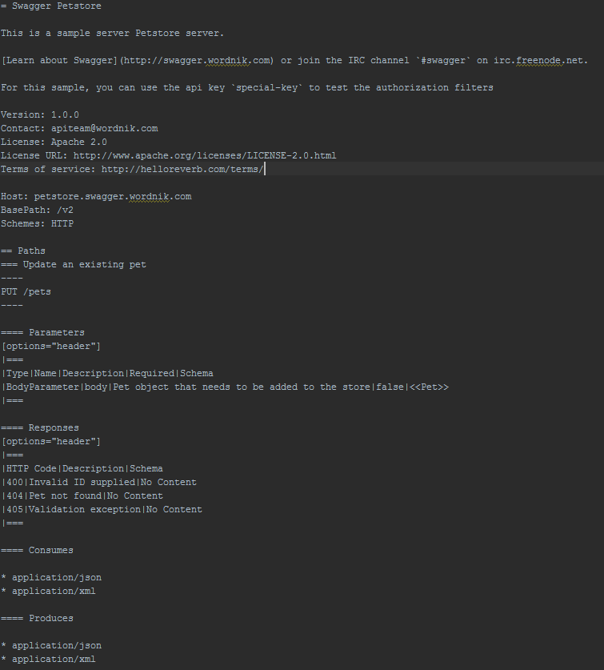

= Dokumentation von RESTful APIs mittels Swagger und AsciiDoc
:toc: left
:toclevels: 4
'':source-highlighter: coderay
:numbered:
:hardbreaks:
:pagenums:

In den letzten Jahren sind die unterschiedlichsten Projekte entstanden, die die Spezifikation und Dokumentation einer RESTful API vereinfachen sollen. Unter anderem http://swagger.io/[Swagger], http://raml.org/[RAML] oder https://apiblueprint.org/[API Blueprint]. 
All diese Projekte haben zum Ziel ein Spezifikationsformat zu entwickeln, dass maschinenlesbar ist, aber in erster Linie von Menschen erstellt werden können soll. Sie nutzen hierfür unterschiedliche Formate wie JSON, YAML oder Markdown.
XML-basierte Formate wie die  Web Application Description Language (WADL) sind hierfür weniger geeignet.

== Swagger

In diesem Artikel möchte ich näher auf das Spezifikationsformat Swagger v2.0 eingehen. Swagger ermöglicht es eine RESTful API sowohl in YAML als auch in JSON zu spezifizieren. 
http://www.yaml.org/spec/1.2/spec.html[YAML] ist eine Auszeichnungssprache zur Datenserialisierung und eine Untermenge von JSON. Das Akronym YAML steht für „YAML Ain’t Markup Language“. YAML ist wesentlich leichter von Menschen zu lesen und zu schreiben als beispielsweise XML. Es wird mitlerweile in vielen Projekten (u.a. Spring Boot) auch als Format für Konfigurationsdateien verwendet, da sich hiermit besser hierarchische Strukturen abbilden lassen als beispielsweise mit Property-Dateien.
Das Swagger Projekt bietet einen http://editor.swagger.io/[Online-Editor] für API-Designer an, mit dem eine RESTful API spezifizieren werden kann.

.Listing 1
[source, yaml]
----
swagger: "2.0"
info:
  description: This is a sample server Petstore server.
  version: "1.0.0"
  title: Swagger Petstore
  termsOfService: http://helloreverb.com/terms/
  contact:
    name: apiteam@wordnik.com
  license:
    name: Apache 2.0
    url: http://www.apache.org/licenses/LICENSE-2.0.html
host: petstore.swagger.wordnik.com
basePath: /v2
schemes:
  - https
paths:
  /pets/{petId}:
    get:
      tags:
        - pet
      summary: Find pet by ID
      description: Returns a pet
      produces:
        - application/json
      parameters:
        - in: path
          name: petId
          description: ID of pet that needs to be fetched
          required: true
          type: integer
          format: int64
      responses:
        "404":
          description: Pet not found
        "200":
          description: successful operation
          schema:
            $ref: "#/definitions/Pet"
        "400":
          description: Invalid ID supplied
----

Die erstellte Spezifikation wird in dem Editor live als eine interaktive HTML-basierte API-Dokumentation (swagger-ui) dargestellt. 

.Swagger HTML Dokumentation
image::images/html_swagger.png[]

Diese HTML-basierte API-Dokumentation ermöglicht es derzeit aber noch nicht, die API-Spezifikation offline anschauen zu können. Des Weiteren kann die Spezifikation nicht im PDF-Format exportiert werden. Ein PDF-Format ist aber oft notwendig, wenn die API-Spezifikation in einer Ausschreibung für ein Software-Projekt mit ausgehändigt werden muss.

Ein weiteres Manko der HTML-basierten API-Dokumentation ist, dass eine detailliertere Beschreibung der API, wie z.B. Nutzungsbeispiele in verschiedenen Programmiersprachen oder echte HTTP-Request und HTTP-Response Beispiele, nicht dargestellt werden können. Ein Beispiel für eine sehr gute API-Dokumentation, die dies berücksichtig, ist der Developer Guide von https://developer.github.com/v3/[GitHub]. 
Es stellen sich also drei Fragen:

* Wie kann eine Swagger Spezifikation um handgeschriebene Dokumentation erweitert werden? 
* Wie kann die Spezifikation sowohl im HTML als auch PDF Format erstellt werden?
* Wie können echte Nutzungsbeispiele hinzugefügt werden?

== Swagger und AsciiDoc

http://asciidoctor.org/docs/asciidoc-writers-guide/[AsciiDoc] ist eine Auszeichnungssprache vergleichbar mit Markdown, allerdings deutlich umfangreicher. AsciiDoc eignet sich dafür Artikel, Bücher, Ebooks oder Slideshows zu erstellen. AsciiDoc Dateien können in mehrere Formate wie z.B. HTML, PDF, EPUB oder DocBook konvertiert werden. 
AsciiDoc, aber auch Markdown, eignen sicher hervorragend dafür handgeschrieben Dokumentation zu erstellen.

Mit https://github.com/Swagger2Markup[Swagger2Markup] gibt es ein Projekt, dass es ermöglicht eine Swagger Spezifikation in AsciiDoc oder Markdown zu konvertieren. Die Swagger Spezifikation kann sowohl im YAML als auch im JSON Format vorliegen und sowohl lokal als auch remote zugängig sein.
Die Verwendung von Swagger2Markup ist sehr simpel. 

.Listing 2
[source,java]
----
public class Swagger2MarkupTest {

    @Test
    public void convertLocalSwaggerToAsciiDoc() {
        //Local Swagger source
        String location = Swagger2MarkupTest.class.getResource("/json/swagger.json").getPath();
        Swagger2MarkupConverter.from(location) // <1>
          .withMarkupLanguage(MarkupLanguage.ASCIIDOC) // <2>
          .build() // <3>
          .intoFolder("build/docs/asciidoc/generated"); // <4>

        // Then validate that three AsciiDoc files have been created
        String[] files = new File("src/docs/asciidoc/generated").list();
        assertThat(files).hasSize(3)
            .containsAll(Arrays.asList("overview.adoc", "paths.adoc", "definitions.adoc")); // <5>
    }
}
----
<1> Zunächst muss ein `Swagger2MarkupConverter.Builder` erstellt werden, in dem man die Lokation der Swagger Datei angibt. Dies kann swohl eine HTTP URL als auch ein absoluter Dateifpad sein.
<2> Anschließend kann die Auszeichnungssprache ausgewählt werden, in die konvertiert werden soll. AsciiDoc ist als Standard vorausgewählt.
<3> Dann wird eine Instanz des `Swagger2MarkupConverter` gebaut.
<4> Zum Schluß kann der Ziel-Ordner angegeben werden.
<5> Standardmäßig werden drei Dateien erstellt: _overview.adoc_, _paths.adoc_ and _definitions.adoc_

Eine generierte AsciiDoc-Datei sieht wie folgt aus:

.Swagger AsciiDoc Format

Die generierten Swagger AsciiDoc-Dateien können nun mit handgeschriebener Dokumentation (z.B. `hand_written_1.adoc` und `hand_written_2.adoc`) vereint werden. Hierzu erstellt man eine `index.adoc` Datei, die alle Dateien inkludiert.

.Listing 3
----
\include::overview.adoc[]
\include::hand_written_1.adoc[]
\include::hand_written_2.adoc[]
\include::paths.adoc[]
\include::definitions.adoc[]
----

Mittels https://github.com/asciidoctor/asciidoctorj[Asciidoctorj], des  https://github.com/asciidoctor/asciidoctor-gradle-plugin[Asciidoctor Gradle Plugins] oder des https://github.com/asciidoctor/asciidoctor-maven-plugin[Asciidoctor Maven Plugins] kann die `index.adoc` Datei in HTML und PDF konvertiert werden.

Eine generierte HTML oder PDF-Datei sieht dann wie folgt aus:

.AsciiDoc HTML Dokumentation
image::images/asciidoc_html.png[]

== Swagger2Markup und Spring Boot

